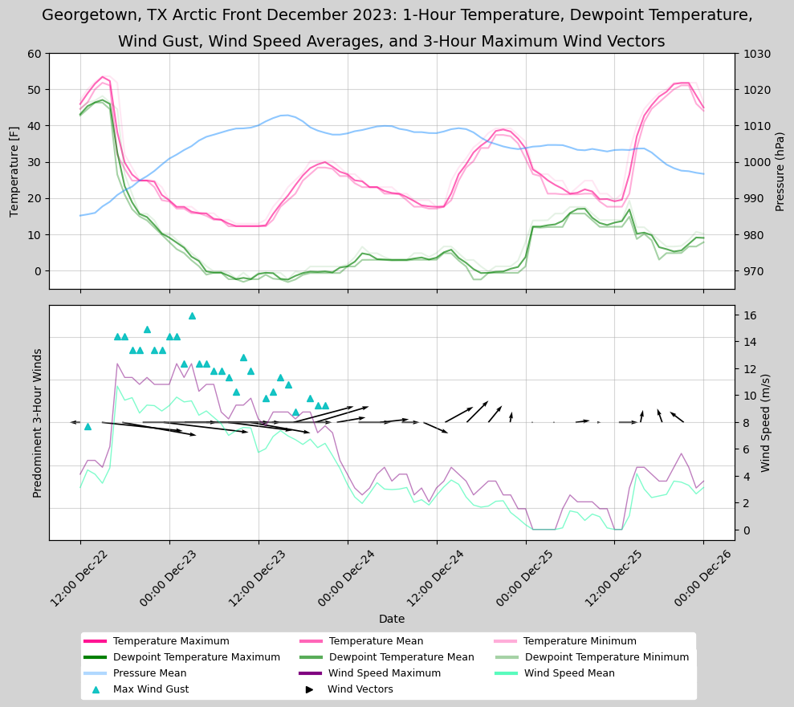
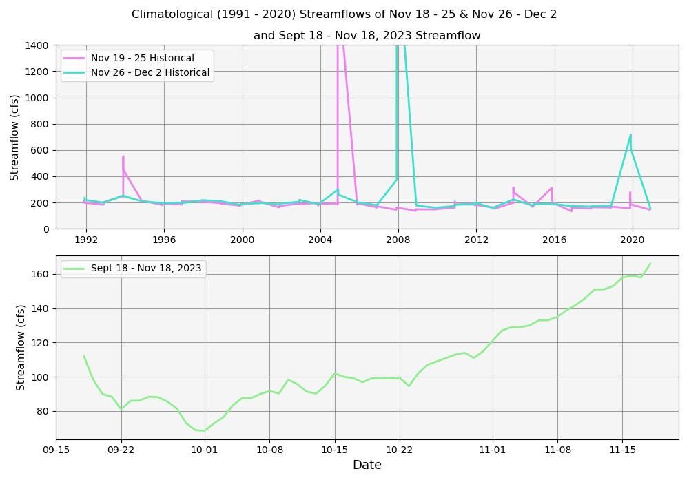

## WEEK 12 HOMEWORK
### Jessica Meyer
### due Nov 20

### Grade
3/3: Great job nice work getting a different location! Your plots also look beautiful. 

Your questions are also very good and are ones that I think others will have too. We'll review Json and API in class tomorrow. 

**1. A brief summary of how I chose to generate my forecast this week.**
I chose to generate my forecast by using the climatological 25% quantile and adding 5. This method seems to align within 7-10 cfs of the actual data over the previous few weeks. 

**2. A description of the dataset I added**

*What is the dataset? Why did I choose it?*
The dataset is from synoptic data and I created the API url by using the API builder and specifying the location and period of interest. I chose this because I was interested in the arctic weather event that occurred within central Texas this past winter and wanted to try and visualize the frontal system passing.

*What location did I choose?* 
The location is Georgetown, Texas which is just north of Austin, Tx, where I was staying over winter break during the event.

*Where did I get the data from?*
I retrieved this data from synptic data.

*What was my approach to accessing it?*
My approach to accessing it included using the API Query builder to identify the station which observed the data and the associated time frame of the arctic front. I also included my personal token within the builder so that there were not extra steps within my script and it stayed more organized. 

**3. A plot of my additional time series along with my streamflow time series.**

**4. Reflections on any questions or uncertainties I have after this week.**

I am still uncertain as to what an API is, other than it provide me a link to a specific data source. Also, I was unable to correct my ax2 y-axis values so that my wind vectors would be more pronounced, how could I do this? Also, when plotting two y-axes on the same plot, how could a legend be shown within the same legend for both y-axes without making a completely separate legend? Lastly, I am a bit confused as to what json file is. It was really cool using data directly from a source rather than downloading it and taking up space on my local drive!! 