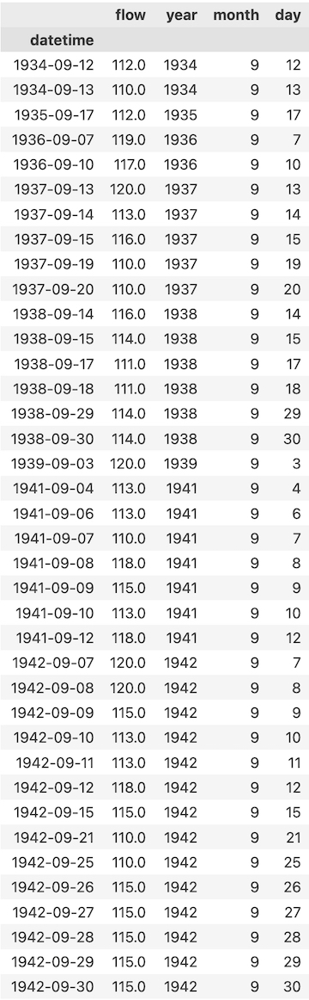

## Homework 6
### Jessica(Jess) Meyer
### due October 9

###
3/3- Great job!
Note for next time if you have a lto of numbers to report its okay with me if you take a screen shot of the table that VS code produces and just submit that so you don't have to type out all the numbers. 
###

### Assignment questions
 In addition to providing a summary of the forecast values you picked and why include the following analysis in your homework submission. 
 Note that questions 3-5 are the same as last weeks questions, however this time you are expected to calculate your answer using the panda's dataframe

#### Forecast Analysis Explanation
My forecast analysis looked at a few average values pertaining to the early weeks of october, and a time series of each week's streamflow values so that I could compare the normal against the recent known streamflow values. The first week of october provided an average for 2023 that is almost 100 cfs lower than the 2010 to current average, with the second and third weeks of october displaying decreases in streamflow averages. Thus, my estimates or guesses are based on the limited information surrounding these values, and the current climate models knowledge suggesting drought. My 1 week out forecast is 50 cfs and my 2 week out forecast is 55 cfs.

#### Question 1
Provide a summary of the data frames properties.
  - What are the column names?
      - the column names were initially agency_cd, site_no, datetime, flow, and code. However, I didnt need a majority of that information, so I specified only the datetime and flow columns.
  - What is its index?
      - the initial index is assigned to the dataframe of 0 to 32,697 but after dropping all 'nan' values, the index is 0 to 16,990, and I changed its index to be datetime.
  - What data types do each of the columns have?
      - using the data.info() function, the agency_cd, datetime, and code are objects; the site_no is a 64-bit integer; flow is a 64-bit float.

#### Question 2
Provide a summary of the flow column including the min, mean, max, standard deviation and quartiles.

Using the .describe() function, I retrieved...
- min: 19.00
- mean: 376.03
- max: 63,400.00
- standard deviation: 1,431.28
- quartiles:
  - 25%: 98.00
  - 50%: 165.00
  - 75%: 226.00

#### Question 3
Provide the same information but on a monthly basis (i.e. for all January, February, March etc). (Note: you should be able to do this with one or two lines of code)
- January:
  - min: 158.00
  - mean: 607.82
  - max: 63,400.00
  - standard deviation: 2314.06
  - quartiles:
    - 25%: 204.25
    - 50%: 224.00
    - 75%: 300.75
- February:
  - min: 136.00
  - mean: 928.96
  - max: 61,000.00
  - standard deviation: 3047.85
  - quartiles:
    - 25%: 204.5
    - 50%: 254.00
    - 75%: 649.00
- March:
  - min: 97.00
  - mean: 1213.71
  - max: 42,200.00
  - standard deviation: 2675.81
  - quartiles:
    - 25%: 199.25
    - 50%: 487.00
    - 75%: 1297.50
- April:
  - min: 64.90
  - mean: 450.39
  - max: 10,800.00
  - standard deviation: 878.69
  - quartiles:
    - 25%: 116.00
    - 50%: 157.00
    - 75%: 323.00
- May:
  - min: 39.9
  - mean: 112.91
  - max: 886.00
  - standard deviation: 72.70
  - quartiles:
    - 25%: 80.00
    - 50%: 95.30
    - 75%: 120.00
- June:
  - min: 22.10
  - mean: 70.40
  - max: 481.00
  - standard deviation: 28.63
  - quartiles:
    - 25%: 52.53
    - 50%: 66.95
    - 75%: 83.00
- July:
  - min: 19.00
  - mean: 108.21
  - max: 5,270.00
  - standard deviation: 190.87
  - quartiles:
    - 25%: 57.00
    - 50%: 75.10
    - 75%: 112.00
- August:
  - min: 29.60
  - mean: 186.96
  - max: 5360.00
  - standard deviation: 272.34
  - quartiles:
    - 25%: 88.00
    - 50%: 129.00
    - 75%: 201.00
- September:
  - min: 37.50
  - mean: 192.97
  - max: 6,600.00
  - standard deviation: 380.24
  - quartiles:
    - 25%: 91.3
    - 50%: 122.00
    - 75%: 180.00
- October:
  - min: 55.70
  - mean: 164.65
  - max: 4,290.00
  - standard deviation: 192.24
  - quartiles:
    - 25%: 113.00
    - 50%: 141.00
    - 75%: 166.00
- November:
  - min: 117.00
  - mean: 203.06
  - max: 4,600.00
  - standard deviation: 200.57
  - quartiles:
    - 25%: 1158.00
    - 50%: 179.00
    - 75%: 200.00
- December:
  - min: 153.00
  - mean: 327.87
  - max: 28,700.00
  - standard deviation: 960.58
  - quartiles:
    - 25%: 193.00
    - 50%: 207.00
    - 75%: 232.00

#### Question 4
Provide a table with the 5 highest and 5 lowest flow values for  the period of record. Include the date, month and flow values in your summary. (Hint: you will want to use the sort_values function for this)

#### Question 5
Provide a list of historical dates with flows that are within 10% of your week 1 forecast value for the month of September. If there are none than increase the %10 window until you have at least one other  value and report the date and the new window you used

There was a massive gap of missing data during the 1980's. My week 1 streamflow forecast was 115 cfs, thus, my range of streamflows was from 109.25 cfs to 120.75 cfs. There were 109 occurrences within the period of record when the streamflow fell within 10% of my week 1 forcast.

 

