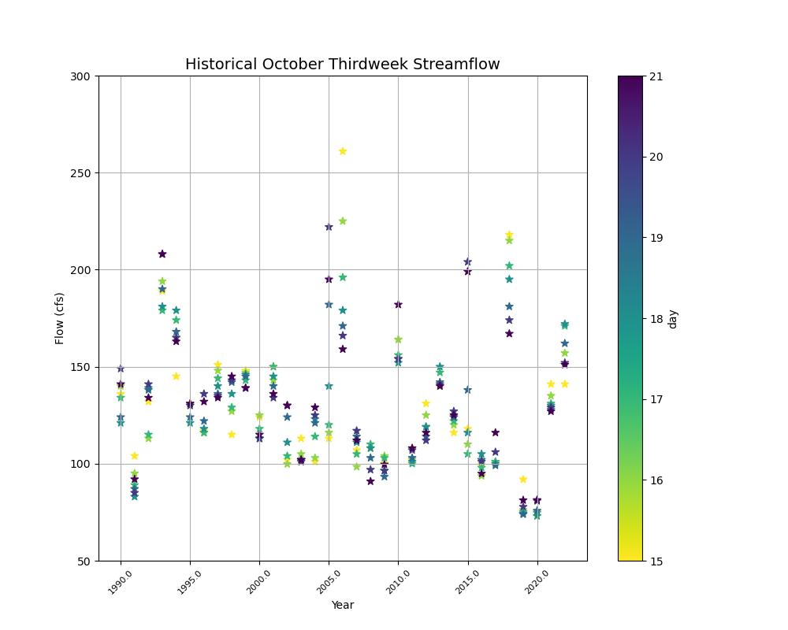
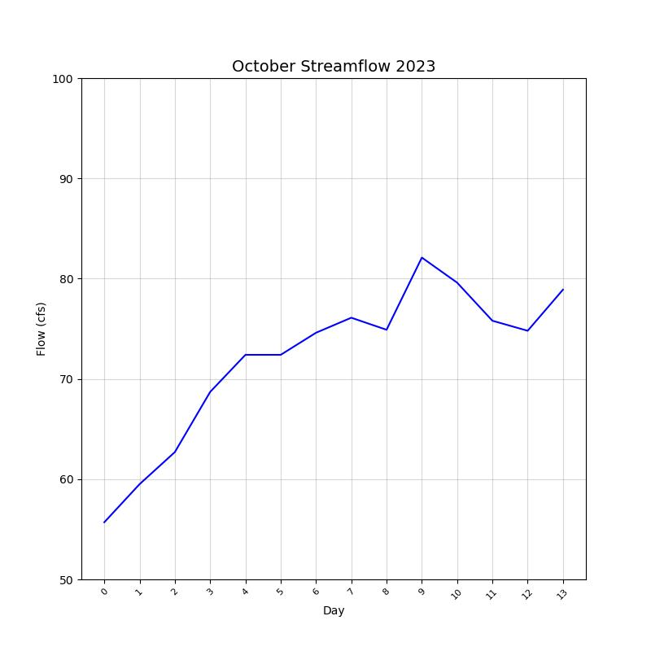
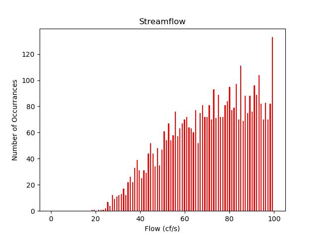
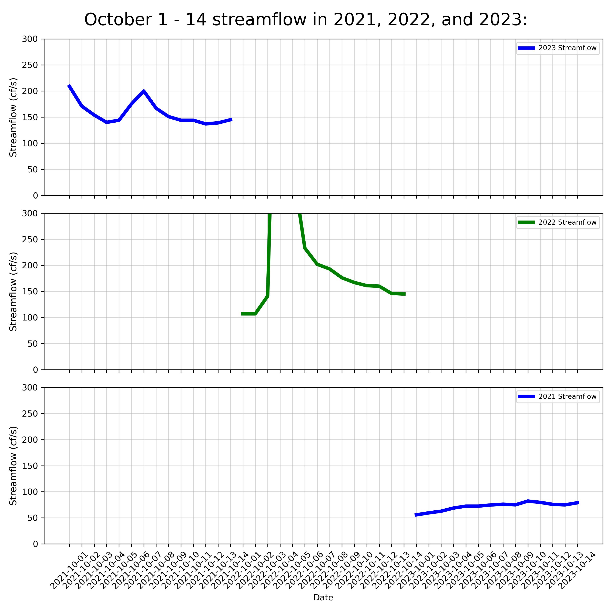

## Homework 7
### Jessica Meyer
### due Oct 16

#### Assignment
1. Summarize your forecast and for the week and how you came up with it

   I came up with a 91 cfs 1 week outlook and a 117 cfs 2 week outlook by evaluating the means of prior years that had similar trends and adjusting those trends to a new timeline. The dry years were 2019 and 2020 during the month of October, so i compared those values to the 2023 october values, adjusted the timeframe to find similar flow and patterns, then made an educated guess. 
   
2. Create 5 plots that summarize the streamflow data and help you make your forecast. You can plot anything that you want as long as you meet the following requirements: 
   - You must have 3 different types of plots (e.g. line, scatter, histogram, bar..)

I genuinely have no reason for why I chose these plots, except for the scatterplot, I enjoy looking at something more colorful.
   
    
   

   - You must have one multi panel plot (note that counts as one plot regardless of the number of subplots you have)
   

   - All plots must have a legend, title, and appropriate axis labels
   - One of your plots should include at least two items (e.g. two different lines, a line and some dots, a filled area and a line)
 

3. For each of your plots copy the image into your markdown and include a sentence describing the plot and explaining why you chose to plot what you did. 

I wanted to try and do a few different plots to see if I could. They were difficult and I had a lot of issues with keeping my 'datetime' index intact for the new dataframes or subsets.

4. Write a short reflection on your progress so far: 
   - Favorite things you have learned or are feeling more confident about. 
   - Things you are still confused/struggling with

I enjoyed the scatterplot but I am so confused with how to create a singular plot without using the plt.plot syntax. The color bars are cool. 